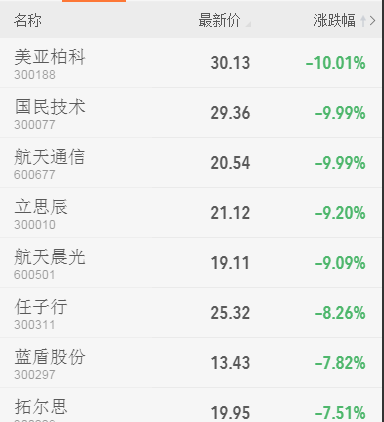

# table-sorter
非table结构列表下的排序



表格排序用法
```
  $('#wave-in-similar').sortTable({
      tableTitle:$('#wave-in-similar .table_col2 .table_title'),  //表头对象，必须唯一
      tableRowClass:'sort_row',                                   //排序行的class
      relativeTable:$('#wave-in-similar .table_col1'),            //关联排序列对象
      relativeRowClass:'row_relative',                            //关联行的class
  });
```
   功能
   可针对某一列进行数据排序，可指定排序类型为float和date


  使用需知
  1.依赖zepto插件,用到了选择器和tap事件
  2.程序在输出时，必须给数据元素的标签上加上data-value=10.23 之类的数据，这样数据格式的变化不会影响排序时值的获取
  3.程序在输出时，必须给需要排序的行加上特定class名，并作为tableRowClass参数传入
  4.排序列的表头列需加上data-type属性，来指定此列按照什么类型排序，float为浮点，data为日期，如果不写data-type默认为string  <span class="has_filter" data-type="float">1周</span>
  5.结构中必须给排序列表头加上class=has_filter  标明此列需要排序
  6.升序时插件会给表头列元素加上class名 filter_ascending  降序加上class名 filter_dscending
  7.如果某个数据不参与排序，则data-value='' 设为空即可始终处于排序队尾 
  8.如存在联动列，需要给每个排序行加上data-order属性，值递增  ```<div data-order="0" class="table_item bdb sort_row">...</div>```

  示例html结构
  ```
  <ul class="ul_table" id="sort-table">
   <li class="table_title">
     <span class="has_filter">列1</span>
     <span class="has_filter" data-type="float">列2</span>
     <span class="has_filter" data-type="date">列3</span>
     <span class="has_filter" data-type="float">列4</span>
   </li>
   <li class="sort_row" data-order="0">
     <span data-value="A">A</span>
     <span data-value="1">1</span>
     <span data-value="5/9/2008">5/9/2008</span>
     <span data-value="120">120%</span>
   </li>
   <li class="sort_row" data-order="1">
     <span data-value="B">B</span>
     <span data-value="6">6</span>
     <span data-value="6/9/2008">6/9/2008</span>
     <span data-value="116">116%</span>
   </li>
   <li class="sort_row" data-order="2">
     <span data-value="C">C</span>
     <span data-value="7">7</span>
     <span data-value="5/10/2010">5/10/2010</span>
     <span data-value="108">108%</span>
   </li>
  </ul>
  ```
